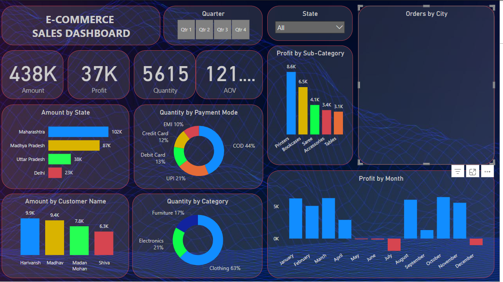

<h1 align="center">📈 E-commerce Data Analysis Dashboard</h1>

  

  

---

## 🚀 About the Project

🔍 This Power BI dashboard project dives deep into a real-world **e-commerce dataset**, showcasing advanced **data cleaning**, **visual storytelling**, and **business intelligence** to uncover key insights that drive decision-making.

Built to highlight the skills of a **Professional Data Analyst**, this project serves as a complete case study from raw data to rich visualizations.

---

## 🧠 Key Insights & Features

✅ **Sales & Revenue Trends**  
✅ **Customer Segmentation**  
✅ **Top-Selling Categories & Products**  
✅ **Profit Margin Analysis**  
✅ **Interactive Filters & Time Series**  
✅ **Geo-Analysis of Sales by Region**

---

## 🛠️ Tools & Technologies

- 📊 **Power BI Desktop**
- 🧹 Power Query (ETL Process)
- 📄 DAX (Data Analysis Expressions)
- 🧠 Analytical Thinking & Data Storytelling
- 🎨 UX-focused Data Visualizations

---

## 📸 Dashboard Preview

| KPI View | Category Performance |
|---------|----------------------|
|  |  |

> 📌 *More screenshots available in the `/images/` folder*

---

## 📁 Project Structure

# 📊 E-commerce Analysis – Power BI Dashboard

This Power BI project provides insights into e-commerce sales performance, customer trends, and product analytics.

## 📂 Project Structure

- `Dashboard.pbix` – Power BI file with interactive dashboard
- `dataset.csv` – Raw data used in the analysis
- `images/` – Contains screenshots of the dashboard

## 🚀 Key Features

- Sales performance by category & sub-category
- Customer behavior insights
- Profit margin trends
- Interactive filters (time, location, category)

## 📸 Dashboard Preview

## 🎯 Objective

To identify sales trends and improve decision-making using visual analytics.

## 🔗 Optional: Live Report Link

> You can embed a Power BI web link here later if published.

## 👨‍💼 Author

Vivek Tripathi  
[GitHub](https://github.com/Vivek-Tripathi00) | [LinkedIn](https://www.linkedin.com/in/your-link)

---

## 🎯 Project Goals

- Transform raw data into actionable business intelligence
- Showcase end-to-end analytical capability
- Demonstrate professional Power BI dashboard design
- Practice real-world data storytelling for stakeholders

---

## 🔗 Live Report *(Optional)*

📢 If you have published to Power BI Service, you can embed it here:

**👉 [Click to view live dashboard](https://app.powerbi.com/view?r=your_link_here)**

---

## 💼 Author & Contact

**👨‍💼 Vivek Tripathi**  
`Data Analyst | Dashboard Expert | Power BI Specialist`

🔗 [GitHub](https://github.com/Vivek-Tripathi00)  
🔗 [LinkedIn](https://www.linkedin.com/in/your-link)  
📧 vivektripathi9500@gmail.com

---

  
  
  
  

---

## 📌 Highlighted Skills

- ✅ End-to-End Analytical Workflow
- ✅ Strong Business Acumen
- ✅ Professional Power BI UI/UX Design
- ✅ KPI-Centric Analysis
- ✅ Executive-Level Presentation Readiness

---

> 🏆 *This project is part of a growing portfolio demonstrating expertise in solving real-world business problems through data.*

---

