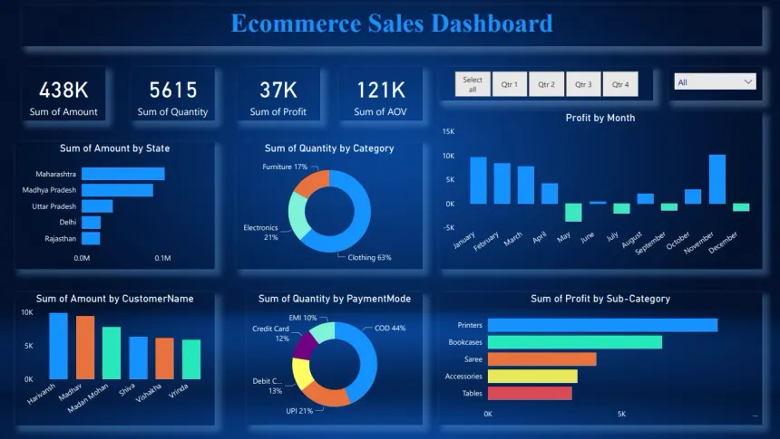

<h1 align="center">📊 E-Commerce Sales Dashboard - Power BI Project</h1>

  

  

---

## 🚀 Project Overview

This professional Power BI dashboard project is based on a **real-world e-commerce dataset**, designed to extract valuable insights and present them through compelling data storytelling and visualizations. It represents the full data lifecycle—**cleaning, transformation, modeling, and visualization**—with a business-centric approach for decision-makers.

> 📌 **Goal:** Provide stakeholders with an interactive tool to track sales, customer behavior, and product profitability across time, geography, and segments.

---

## 🧠 Key Business Insights

Here are a few high-impact insights uncovered from the dashboard:

### 🔹 KPI Summary
- **Total Sales Amount:** ₹438K
- **Total Profit:** ₹37K
- **Quantity Sold:** 5615 units
- **Average Order Value (AOV):** ₹121

### 🔹 State-wise Sales Distribution
- **Top Performing State:** Maharashtra (₹102K)
- **Madhya Pradesh** also contributes significantly (₹87K), while **Delhi** and **Uttar Pradesh** show lower sales, indicating regions with untapped potential or lower market penetration.

### 🔹 Payment Method Trends
- **Cash on Delivery (COD)** dominates with **44%** of total quantity.
- UPI and Debit Cards are popular digital modes (21% and 13% respectively).
- Suggests growing acceptance of digital payments, but COD still leads.

### 🔹 Top Performing Sub-Categories (by Profit)
- **Printers** generate the highest profit (₹8.6K), followed by **Bookcases** and **Phones**.
- **Tables** and **Accessories** have lower profitability, indicating potential underperformance or high cost ratios.

### 🔹 Monthly Profit Trends
- High profits observed in **January, March, August, and October**.
- Significant losses occurred in **June, July, and December**, suggesting periods of concern or seasonal challenges.
- Useful for future campaign planning and inventory optimization.

### 🔹 Customer-Wise Contributions
- **Harivansh and Madhav** are high-value customers.
- Ideal for targeting loyalty programs or personalized offers.

### 🔹 Category-Wise Quantity Sold
- **Clothing leads** with **63% of total sales quantity**, indicating it as the highest-volume segment.
- **Electronics** and **Furniture** follow, but represent a smaller share.

---

## 🎯 Core Objectives

- 🔍 **Identify key sales drivers and low-performing areas**
- 🧭 **Support decision-making with interactive filters and dynamic visuals**
- 🎨 **Deliver professional-grade, UX-optimized visual analytics**
- 💡 **Uncover seasonal, regional, and customer-centric patterns**

---

## 📁 Project Structure

| File/Folder         | Description                                  |
|---------------------|----------------------------------------------|
| `Dashboard.pbix`    | Power BI file with all reports & visuals     |
| `dataset.csv`       | Cleaned and structured e-commerce dataset    |
| `images/`           | Screenshots and visual previews              |
| `README.md`         | Full project documentation                   |

---

## 🛠️ Tools & Technologies

- 📊 **Power BI Desktop**
- 🧼 **Power Query (M Language)** – ETL Process
- 📈 **DAX (Data Analysis Expressions)** – Measures, KPIs, Time Intelligence
- 🎨 **Advanced UX Design** – Responsive layout, color schemes, cards, charts
- 🧠 **Analytical Thinking** – Strategic insights & storytelling

---

## 📸 Dashboard Sections

| Section Title             | Visual Type                     | Purpose                                               |
|--------------------------|----------------------------------|-------------------------------------------------------|
| KPI Overview              | Cards                            | Instant metrics snapshot                              |
| Sales by State            | Bar Chart                        | Geo-segmentation analysis                             |
| Payment Mode Split        | Donut Chart                      | Customer payment preferences                          |
| Profit by Sub-Category    | Clustered Bar Chart              | Product-level performance                             |
| Monthly Profit Trends     | Column Chart (with negatives)    | Time series profit tracking                           |
| Customer Purchase Amount  | Bar Chart                        | Identify valuable customers                           |
| Category Quantity Split   | Donut Chart                      | Product mix analysis                                  |

---

## ✨ Highlights & Features

✅ **Interactive Filters** – Quarter & State selector  
✅ **Responsive Layout** – Optimized for usability & readability  
✅ **Color-Coded Visuals** – Intuitive understanding of trends  
✅ **Profitability Analysis** – Identifying underperforming categories  
✅ **Segmentation** – By time, geography, category, and customer  

---

## 👨‍💼 Author

**Vivek Tripathi**  
🎯 Data Analyst | Dashboard Expert | Power BI Specialist

- GitHub: [Vivek-Tripathi00](https://github.com/Vivek-Tripathi00)  
- LinkedIn: [linkedin.com/in/vivek-tripathi-b7465127a](https://www.linkedin.com/in/vivek-tripathi-b7465127a/)
- 📧 Email: vivektripathi9500@gmail.com  

---

## 🏆 Skills Demonstrated

- ✅ Full-cycle Data Analytics (ETL → Modeling → Visualization)
- ✅ Power BI UI/UX Best Practices
- ✅ Executive-Level Business Intelligence
- ✅ Actionable Insights with Data Storytelling
- ✅ Time, Customer, and Product-based Segmentation

---

  
  
  
  

---

## 🧩 Potential Enhancements

- Embed a **forecasting model** for seasonal prediction  
- Integrate **product-level profitability analysis**  
- Add **RLS (Row-Level Security)** for user-specific views  
- Deploy via **Power BI Service** with scheduled refreshes

---

> 🚀 *This dashboard is a prime example of how clean design, smart analytics, and real-world data can work together to tell a compelling business story.*
